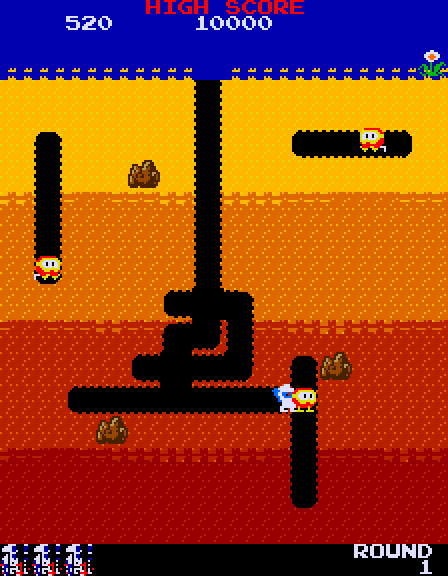
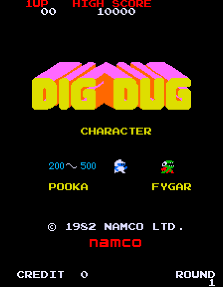
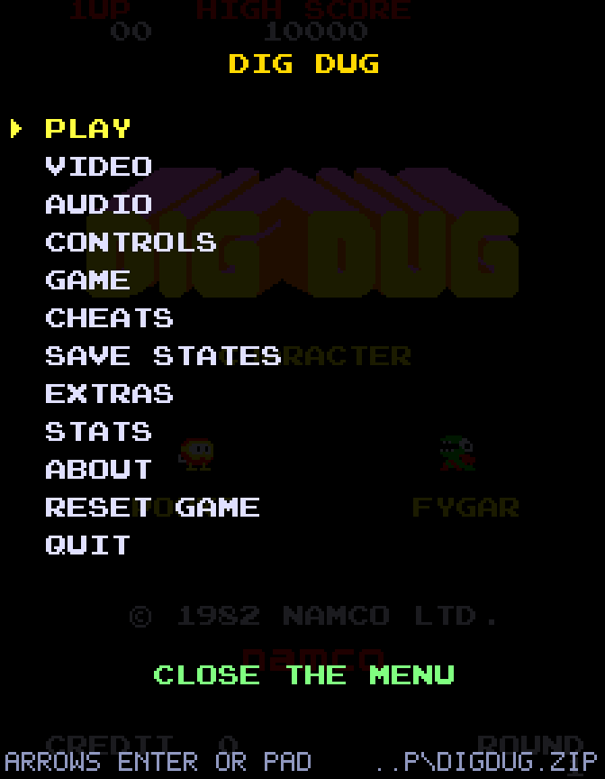
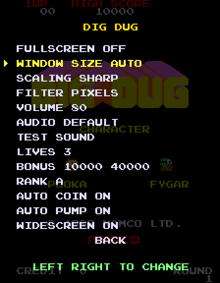
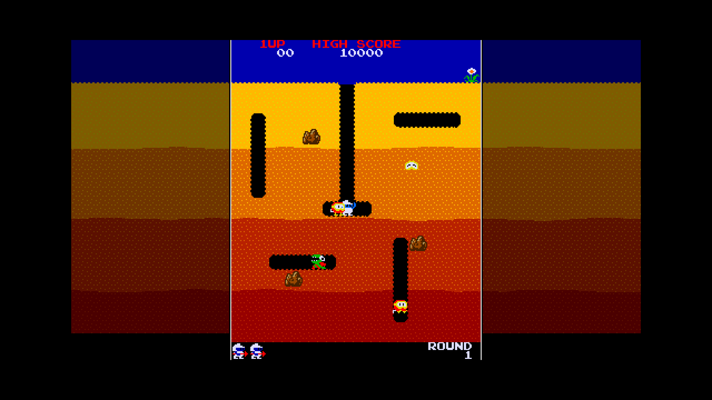
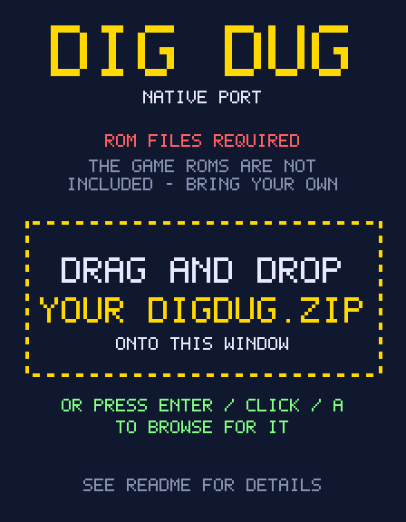

<div align="center">

# Dig Dug – native PC port

**Namco's 1982 arcade classic as a standalone Windows and Linux program – with controller support, widescreen fill, an in-game menu and more.**

[](https://github.com/TekRantGaming/digdug-native/actions/workflows/build.yml)
[](https://github.com/TekRantGaming/digdug-native/releases/latest)
[](LICENSE)

  

</div>

> **AI disclosure:** this project was created with AI. It may contain errors.

> **You must supply your own ROMs.** This repository and its releases contain **no** game ROM files (the build
> pipeline checks for this and fails if any are found). You need your own legally obtained copy of the Dig Dug
> (MAME `digdug`) ROM set – see [Getting the ROMs](#getting-the-roms). The program asks for the file and you can
> drag and drop `digdug.zip` onto its window. Dig Dug is © Bandai Namco Entertainment; this project is unofficial
> and unaffiliated.

---

## Table of contents

- [What is this?](#what-is-this)
- [Features](#features)
- [Download and run](#download-and-run)
- [Getting the ROMs](#getting-the-roms)
- [Controls](#controls)
- [The menu and options](#the-menu-and-options)
- [Widescreen mode](#widescreen-mode)
- [Command line](#command-line)
- [Building from source](#building-from-source)
- [Troubleshooting / FAQ](#troubleshooting--faq)
- [Is this a decompilation?](#is-this-a-decompilation)
- [How it works](#how-it-works)
- [Project layout](#project-layout)
- [Contributing](#contributing)
- [Credits and legal](#credits-and-legal)

## What is this?

Dig Dug runs on an arcade board with **three Z80 processors**, shared RAM, custom Namco I/O chips, a tile/sprite video
system on a vertical monitor, and a 3-voice wavetable sound chip. This project re-creates that board in C# (.NET 8) and
wraps it in a proper PC front end built on SDL2. The original game code from *your* ROMs runs unmodified – so the game
plays exactly as it did in the arcade – while everything around it is modern: gamepads, fullscreen, scaling, settings,
and packaging as a self-contained `.exe` and a Linux **AppImage** (no RetroArch or MAME required).

## Features

- **Faithful gameplay** – attract mode, credits, scoring, pump, rocks, enemy AI, round progression, high-score memory
- **Game controller support** – Xbox 360 / One / Series, PlayStation 4 (DualShock 4) and PlayStation 5 (DualSense),
  Switch Pro and most other gamepads, with hot-plugging (via SDL's controller database)
- **In-game menu** (Esc, or the PS / Guide button) – fullscreen, window size, sharp or smooth scaling, volume,
  **audio device picker**, lives, bonus-life thresholds, difficulty rank, auto-coin, auto-pump, widescreen
- **Widescreen fill** – on 16:9 and wider screens the dirt is extended to the sides instead of leaving big black bars,
  with a clear frame marking the real playfield edge
- **Auto pump** – hold fire and the pump keeps inflating (the arcade game wants release-and-press for every pump step)
- **Auto coin** – just press Start; no need to insert a coin first
- **Windows `.exe` and Linux AppImage**, fast-forward (hold Tab), pause, persistent settings and high scores
- The ~30-second power-on self-test is fast-forwarded automatically
- No installer, no runtime to install: the downloads are self-contained

<details>
<summary>More screenshots</summary>

| Options | Widescreen (16:9) |
|---|---|
|  |  |

</details>

## Download and run

Grab the latest build from the **[Releases](https://github.com/TekRantGaming/digdug-native/releases/latest)** page.

### Windows (10/11, 64-bit)

1. Download `DigDug-windows-x64.zip` and extract it anywhere.
2. Put your ROMs next to `DigDug.exe` in a folder called `roms` (or just run it – it will ask you to pick `digdug.zip`).
3. Run `DigDug.exe`.

Windows SmartScreen may warn about an unrecognised app because the executable is not code-signed; choose
*More info -> Run anyway*.

### Linux (x86-64)

1. Download `DigDug-x86_64.AppImage`.
2. `chmod +x DigDug-x86_64.AppImage`
3. Put `digdug.zip` in the same folder as the AppImage (or run it and pick the file when asked), then run
   `./DigDug-x86_64.AppImage`.

If your system has no FUSE: `./DigDug-x86_64.AppImage --appimage-extract-and-run`.
Controllers need the usual udev permissions (most desktop distros handle this automatically).

## Getting the ROMs

You need the MAME-style `digdug` ROM set (revision "a"): `dd1a.1 … dd1a.6`, `dd1.7`, `dd1.9`, `dd1.10b`,
`dd1.11 … dd1.15`, `136007.110 … 136007.113`. Either the `.zip` or the extracted files work.

The game looks for them in this order:

1. a path given on the command line (`DigDug path/to/digdug.zip`) or `--roms <path>`
2. the path remembered from last time
3. a `roms/` folder or `digdug.zip` next to the program (or next to the `.AppImage`)
4. the per-user config folder: `%APPDATA%\DigDugNative\roms` (Windows) or `~/.config/DigDugNative/roms` (Linux)

If nothing is found, the window shows a **"ROM files required"** page: **drag and drop `digdug.zip` onto the window**, or press Enter / click / A to open a file picker. Nothing blocks the window, so dropping works at any time. The location is remembered after the first successful load.

<p align="center"></p>

## Controls

| Action | Keyboard | Controller |
|---|---|---|
| Move | Arrow keys / WASD | D-pad or left stick |
| Pump (hold to keep pumping) | Space / Ctrl / Z / X | A, B, X, Y, R1 or either trigger |
| Insert coin | 5 / C | Back / Select / Share (or just press Start – *Auto coin*) |
| 1-player start | 1 / Enter | Start / Options |
| 2-player start | 2 | L1 |
| Menu | Esc / F1 | PS / Guide button, or press the right stick (R3) |
| Fullscreen | F11 / F | menu |
| Pause / fast-forward | P / hold Tab | – |
| Reset machine | F3 | menu |
| Service/test screen | hold F2 while booting | – |

## The menu and options

Open it with **Esc** (or the PS / Guide button). Navigate with the arrow keys or D-pad, change values with
Left/Right, confirm with Enter or A.

| Option | Description |
|---|---|
| Fullscreen | Borderless fullscreen (also F11) |
| Window size | Auto, or 1x-8x the original resolution |
| Scaling | *Sharp* = whole-number scale factors only; *Fit* = fill as much of the window as possible |
| Filter | *Pixels* (crisp) or *Smooth* (bilinear) |
| Volume / Audio / Test sound | Output volume and **output device selection** with a test tone |
| Lives / Bonus / Rank | The arcade DIP-switch settings: 1/2/3/5 lives, bonus-life thresholds, difficulty A-D |
| Auto coin | Pressing Start with no credit inserts one automatically |
| Auto pump | Holding fire pumps continuously |
| Widescreen | Extend the playfield on wide windows |

Settings are saved to `%APPDATA%\DigDugNative\settings.ini` (`~/.config/DigDugNative/settings.ini` on Linux) along
with the high-score memory (`digdug.nv`) and a small `digdug.log` listing the detected audio devices and controllers.

## Widescreen mode

Dig Dug was designed for a **vertical (3:4) monitor**. On a modern 16:9 display that leaves wide black bars. In widescreen
mode the dirt layers and sky are extended to the left and right (dimmed, so it is obvious they are decoration). A bright
frame line marks the **real playfield edges** – you cannot walk or dig beyond it, and gameplay is completely unchanged.
Turn it off in *Options -> Widescreen* if you prefer black bars.

<p align="center"></p>

## Command line

```
DigDug [romfolder-or-zip] [--roms <path>] [--fullscreen] [--lives 1|2|3|5] [--rank A|B|C|D] [--dip0 HEX --dip1 HEX]
```

Developer switches (headless runs, tracing, test bot, screenshots) are documented in
[`docs/DEVELOPMENT.md`](docs/DEVELOPMENT.md).

## Building from source

Requirements: the [.NET 8 SDK](https://dotnet.microsoft.com/download) and SDL2.

```bash
git clone https://github.com/TekRantGaming/digdug-native.git
cd digdug-native
```

**Windows** (PowerShell) – produces `out\win\DigDug.exe` and `SDL2.dll` (downloaded from the official SDL release):

```powershell
./build.ps1
```

**Linux** – produces `out/DigDug-x86_64.AppImage` (needs `libsdl2-2.0-0` and `wget`):

```bash
sudo apt install libsdl2-2.0-0 wget      # Debian/Ubuntu; use your distro's equivalent
bash ./packaging/linux/build-appimage.sh
```

**Any platform, for development** (needs SDL2 installed):

```bash
dotnet run -- --roms path/to/digdug.zip
```

GitHub Actions builds both packages on every push, and a tag starting with `v` publishes a release
(see `.github/workflows/build.yml`).

## Troubleshooting / FAQ

**It asks for ROMs / says the ROM set is incomplete.** See [Getting the ROMs](#getting-the-roms). Make sure it is the
`digdug` set (not `digdugat` or `digduga1`) and that all files listed are present.

**The game started without asking for a ROM - where did it get one?** The program contains no game data; it can only use a ROM set it found on your PC. The menu's bottom line ("ROMS ...") and `digdug.log` say exactly where it was loaded from, and `DigDug.exe --rom-status` prints the same (exit code 3 = none found). The usual cause is a remembered path in `settings.ini` (delete it to forget) or a ROM set next to the program or in the config folder.

**No sound.** Open the menu -> Options -> **Audio** and choose another output device; a test tone plays each time you
change it. Systems with virtual mixers (for example SteelSeries Sonar or Voicemeeter) can send new programs to a channel
you aren't listening to. `digdug.log` lists every output device SDL can see.

**The controller does nothing.** Check `digdug.log` for a "Controller connected" line. PlayStation and Switch pads
work over USB or Bluetooth; if you use Steam Input or DS4Windows, make sure the pad is not hidden from other programs.

**The pump keeps attaching but never inflates.** That's the original game's behaviour with a steadily held button;
leave *Auto pump* on (default) or tap the button.

**Can I play two players?** Yes: press `2` (needs two credits, or let *Auto coin* provide them). Both players share the
same controls, as on an upright cabinet.

**Where are my high scores?** In `digdug.nv` inside the config folder mentioned above.

**macOS?** Not packaged yet, but the code is portable .NET + SDL2 – contributions welcome.

## Is this a decompilation?

No – it is a **hardware emulator written for this one game**, not a decompilation. The original Z80 machine code from
your ROMs still runs exactly as Namco wrote it; this project re-creates the board around it and builds it as a native,
portable PC application. A true decompilation would recover *source code* for the game logic and compile that natively,
without the original machine code. [`docs/HARDWARE.md`](docs/HARDWARE.md) documents what was learned about the board
(memory map, I/O chips, DIP switches, graphics formats, sound registers), which is the groundwork any such effort
would need. Everything that is not the game's own code – CPU, video, sound and chip emulation, the front end, menu,
widescreen mode and controller support – is original work in this repository.

## How it works

- `Z80` – cycle-counted CPU core; three instances run interleaved line by line (264 lines x 192 cycles = 60.6 Hz)
- `Machine` – memory map, interrupts, control latches, the 06xx bus controller and function-level emulation of the
  51xx (credits/joystick) and 53xx (DIP switch) chips
- `Video` – 36x28 tile playfield, text layer and 64 sprites rendered at 288x224 then rotated for the vertical monitor
- `Sound` – the Namco 3-voice wavetable chip
- `App` / `Sdl` – SDL2 front end: window, scaling, widescreen, input, audio, menu

More detail in [`docs/HARDWARE.md`](docs/HARDWARE.md) and [`docs/DEVELOPMENT.md`](docs/DEVELOPMENT.md).

## Project layout

```
src/Z80.cs          Z80 CPU core
src/Machine.cs      Board: memory map, interrupts, latches, 06xx bus, 51xx/53xx chips
src/Video.cs        Playfield / text / sprite renderer, palette PROMs, 90° rotation
src/Sound.cs        Namco 3-voice wavetable synthesiser
src/RomSet.cs       ROM loader (folder or zip)
src/App.cs          SDL2 front end: window, input, audio, menu, widescreen
src/Sdl.cs          Minimal SDL2 bindings
src/Settings.cs     Persistent settings
src/Disasm.cs, DevTools.cs, Bot.cs, Png.cs   Developer tools
packaging/linux/    AppImage recipe
docs/               Hardware notes, developer guide, screenshots
```

## Contributing

Bug reports and pull requests are welcome – see [CONTRIBUTING.md](CONTRIBUTING.md). Please **never** attach ROM files,
disassembly output or other copyrighted game data to issues or pull requests. AI-assisted contributions are fine if you say so.

## Credits and legal

- Dig Dug © 1982 Namco (now Bandai Namco Entertainment). This is an unofficial fan project; no ROM files or other original
  game data are distributed. The screenshots in docs/images are captures of the game running from the owner's own ROM set.
- Source code in this repository is released under the [MIT license](LICENSE). The license covers only the code written
  for this project, **not** the Dig Dug game, its ROMs, artwork or sound.
- [SDL2](https://libsdl.org) © Sam Lantinga and contributors, zlib license.
- Thanks to the arcade preservation community, whose public documentation of Namco's hardware made this much easier
  to verify.
